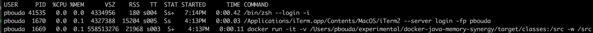
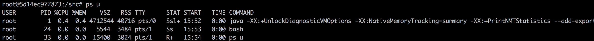
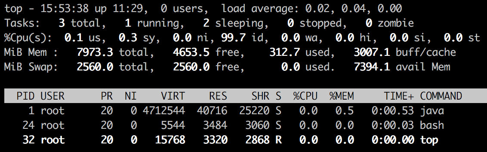
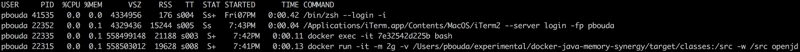
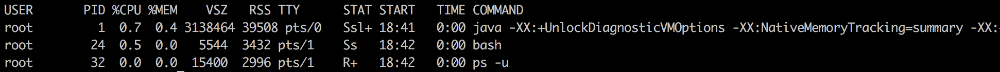
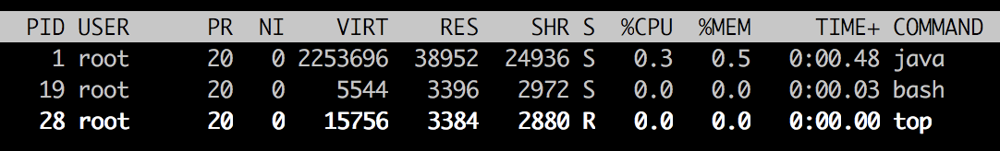
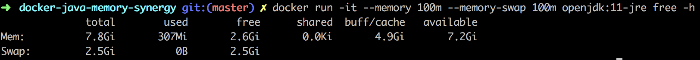
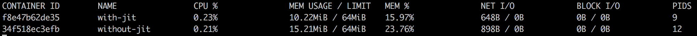

# JVM DOCKER SYNERGY

`NEVER TRUST PROGRAMS SUCH AS: top, free`

`ALWAYS USE: docker stats`

`DISABLE SWAP IN DOCKER CONTAINER: --memory must have same value as --memory-swap`

- Examples based on Java 11

- https://docs.oracle.com/javase/9/docs/api/java/lang/management/MemoryUsage.html
- https://docs.docker.com/config/containers/resource_constraints/
- https://stackoverflow.com/questions/7880784/what-is-rss-and-vsz-in-linux-memory-management

```
By default, a container has no resource constraints and can use as much of a given resource as the host’s kernel scheduler allows.
```

```
docker run -it -v $(pwd)/target/classes:/src -w /src openjdk:11-jre \
java --module-path . \
--add-exports=java.management/sun.management=docker.limits \
--add-exports=java.base/jdk.internal.platform=docker.limits \
--module docker.limits/pbouda.sandbox.docker.Ping
```

## How to see Docker Limits propagated to JVM?

[JVM_DOCKER_MEMORY_DEFAULTS.md](JVM_DOCKER_MEMORY_DEFAULTS.md)

## What is a minimal memory footprint of Application?

```
docker run -it -v $(pwd)/target/classes:/src -w /src openjdk:11-jre \
java -XX:+UnlockDiagnosticVMOptions -XX:NativeMemoryTracking=summary -XX:+PrintNMTStatistics \
--add-exports=java.management/sun.management=docker.limits \
--module-path . --module docker.limits/pbouda.sandbox.docker.MemoryFootprint
```

`ps -u` from HOST



`ps -u` from CONTAINER



`top` from CONTAINER



```
Native Memory Tracking:

Total: reserved=3501041KB, committed=208557KB
-                 Java Heap (reserved=2041856KB, committed=129024KB)
                            (mmap: reserved=2041856KB, committed=129024KB)

-                     Class (reserved=1056921KB, committed=5017KB)
                            (classes #892)
                            (  instance classes #784, array classes #108)
                            (malloc=153KB #1055)
                            (mmap: reserved=1056768KB, committed=4864KB)
                            (  Metadata:   )
                            (    reserved=8192KB, committed=4352KB)
                            (    used=755KB)
                            (    free=3597KB)
                            (    waste=0KB =0.00%)
                            (  Class space:)
                            (    reserved=1048576KB, committed=512KB)
                            (    used=91KB)
                            (    free=421KB)
                            (    waste=0KB =0.00%)

-                    Thread (reserved=17527KB, committed=903KB)
                            (thread #17)
                            (stack: reserved=17448KB, committed=824KB)
                            (malloc=59KB #94)
                            (arena=20KB #32)

-                      Code (reserved=247734KB, committed=7594KB)
                            (malloc=46KB #544)
                            (mmap: reserved=247688KB, committed=7548KB)

-                        GC (reserved=117708KB, committed=46724KB)
                            (malloc=8900KB #1193)
                            (mmap: reserved=108808KB, committed=37824KB)

-                  Compiler (reserved=135KB, committed=135KB)
                            (malloc=4KB #55)
                            (arena=131KB #5)

-                  Internal (reserved=528KB, committed=528KB)
                            (malloc=488KB #1098)
                            (mmap: reserved=40KB, committed=40KB)

-                     Other (reserved=10KB, committed=10KB)
                            (malloc=10KB #2)

-                    Symbol (reserved=1103KB, committed=1103KB)
                            (malloc=743KB #2426)
                            (arena=360KB #1)

-    Native Memory Tracking (reserved=131KB, committed=131KB)
                            (malloc=5KB #64)
                            (tracking overhead=126KB)

-        Shared class space (reserved=17144KB, committed=17144KB)
                            (mmap: reserved=17144KB, committed=17144KB)

-               Arena Chunk (reserved=174KB, committed=174KB)
                            (malloc=174KB)

-                   Logging (reserved=4KB, committed=4KB)
                            (malloc=4KB #179)

-                 Arguments (reserved=18KB, committed=18KB)
                            (malloc=18KB #473)

-                    Module (reserved=48KB, committed=48KB)
                            (malloc=48KB #820)
```

```
HEAP MEMORY
------------------------
INIT: 126 MB
USED: 1 MB
COMMITTED: 126 MB
MAX: 1994 MB

NON-HEAP MEMORY
------------------------
INIT: 7 MB
USED: 2 MB
COMMITTED: 12 MB
MAX: -1 MB
```

#### Facts

- RSS (Resident Set Size) from the container 40MB and from the host 21MB

#### Opened Questions

- Why RSS is twice smaller why I run `ps u` from host than inside a container?
=> Part of the memory could be swapped out?

## Limit Docker Container memory to 2GB

```
docker run -it -m 2g -v $(pwd)/target/classes:/src -w /src openjdk:11-jre \
java -XX:+UnlockDiagnosticVMOptions -XX:NativeMemoryTracking=summary -XX:+PrintNMTStatistics \
--add-exports=java.management/sun.management=docker.limits \
--module-path . --module docker.limits/pbouda.sandbox.docker.MemoryFootprint
```

`ps -u` from HOST



`ps -u` from CONTAINER



```
Native Memory Tracking:

Total: reserved=1925570KB, committed=108066KB
-                 Java Heap (reserved=524288KB, committed=32768KB)
                            (mmap: reserved=524288KB, committed=32768KB)

-                     Class (reserved=1056948KB, committed=5044KB)
                            (classes #979)
                            (  instance classes #865, array classes #114)
                            (malloc=180KB #1357)
                            (mmap: reserved=1056768KB, committed=4864KB)
                            (  Metadata:   )
                            (    reserved=8192KB, committed=4352KB)
                            (    used=1037KB)
                            (    free=3315KB)
                            (    waste=0KB =0.00%)
                            (  Class space:)
                            (    reserved=1048576KB, committed=512KB)
                            (    used=128KB)
                            (    free=384KB)
                            (    waste=0KB =0.00%)

-                    Thread (reserved=16494KB, committed=794KB)
                            (thread #16)
                            (stack: reserved=16420KB, committed=720KB)
                            (malloc=55KB #89)
                            (arena=19KB #30)

-                      Code (reserved=247759KB, committed=7619KB)
                            (malloc=71KB #666)
                            (mmap: reserved=247688KB, committed=7548KB)

-                        GC (reserved=60761KB, committed=42521KB)
                            (malloc=8465KB #613)
                            (mmap: reserved=52296KB, committed=34056KB)

-                  Compiler (reserved=133KB, committed=133KB)
                            (malloc=3KB #45)
                            (arena=131KB #5)

-                  Internal (reserved=530KB, committed=530KB)
                            (malloc=490KB #1117)
                            (mmap: reserved=40KB, committed=40KB)

-                     Other (reserved=10KB, committed=10KB)
                            (malloc=10KB #2)

-                    Symbol (reserved=1126KB, committed=1126KB)
                            (malloc=766KB #2601)
                            (arena=360KB #1)

-    Native Memory Tracking (reserved=131KB, committed=131KB)
                            (malloc=5KB #62)
                            (tracking overhead=126KB)

-        Shared class space (reserved=17144KB, committed=17144KB)
                            (mmap: reserved=17144KB, committed=17144KB)

-               Arena Chunk (reserved=176KB, committed=176KB)
                            (malloc=176KB)

-                   Logging (reserved=4KB, committed=4KB)
                            (malloc=4KB #179)

-                 Arguments (reserved=18KB, committed=18KB)
                            (malloc=18KB #476)

-                    Module (reserved=48KB, committed=48KB)
                            (malloc=48KB #820)
```

```
HEAP MEMORY
------------------------
INIT: 32 MB
USED: 1 MB
COMMITTED: 32 MB
MAX: 512 MB

NON-HEAP MEMORY
------------------------
INIT: 7 MB
USED: 2 MB
COMMITTED: 12 MB
MAX: -1 MB
```

- `40MB (RSS in Container) - 1M (HEAP) - 2MB (NON-HEAP) = ~37MB JVM Overhead? (C code, libraries, JVM Structures)`

## Crashing Docker Container by reducing Container's Memory

- the rule Heap is 1/4 of provided memory is broken when we go under ~512MB
    - docker run -it -m 512m -> MaxHeap 123MB
    - 400m -> 121MB
    - 256m -> 121MB
    - 244m -> 117MB
    - 200m -> 96MB
    - 100m -> 48MB
    - 64m -> 30MB
    - 32m -> 15MB
    - 16m -> 7MB (InitHeap is 8MB)
    - 8m -> 7MB
    
```
HEAP MEMORY
------------------------
INIT: 4 MB
USED: 1 MB
COMMITTED: 3 MB
MAX: 7 MB

NON-HEAP MEMORY
------------------------
INIT: 7 MB
USED: 2 MB
COMMITTED: 12 MB
MAX: -1 MB
```

- 64m, still bigger than RES (39MB)

```
docker run -it -m 64m ...
```



- 32m, Lower than RES but everything fine, no change, big Virtual Memory

```
docker run -it -m 32m ...
```

## Crashing Docker Container by disabling SWAP memory

- SWAP is disable when `--memory-swap` is set to the same value

```
docker run -it --memory 32m --memory-swap 32m ..
```

=> does not change VIRT memory inside container, same as the examples above

## Crashing Docker Container by reducing Kernel Memory

- https://docs.docker.com/config/containers/resource_constraints/#--kernel-memory-details

```
docker run -it --memory 32m --kernel-memory 32m --memory-swap 32m -v $(pwd)/target/classes:/src -w /src openjdk:11-jre \
java -XX:+UnlockDiagnosticVMOptions -XX:NativeMemoryTracking=summary -XX:+PrintNMTStatistics \
--add-exports=java.management/sun.management=docker.limits \
--module-path . --module docker.limits/pbouda.sandbox.docker.MemoryFootprint
```

=> Same, no Changes

```
Total: reserved=1355555KB, committed=43759KB
-                 Java Heap (reserved=16384KB, committed=8192KB)
                            (mmap: reserved=16384KB, committed=8192KB)

-                     Class (reserved=1056951KB, committed=5047KB)
                            (classes #979)
                            (  instance classes #865, array classes #114)
                            (malloc=183KB #1384)
                            (mmap: reserved=1056768KB, committed=4864KB)
                            (  Metadata:   )
                            (    reserved=8192KB, committed=4352KB)
                            (    used=1029KB)
                            (    free=3323KB)
                            (    waste=0KB =0.00%)
                            (  Class space:)
                            (    reserved=1048576KB, committed=512KB)
                            (    used=128KB)
                            (    free=384KB)
                            (    waste=0KB =0.00%)
```



## Docker Stats, Disabling JIT Compiler

```
docker run -it --memory 64m --memory-swap 64m --name with-jit -v $(pwd)/target/classes:/src -w /src openjdk:11-jre java \
--add-exports=java.management/sun.management=docker.limits \
--module-path . --module docker.limits/pbouda.sandbox.docker.MemoryFootprint

docker run -it --memory 64m --memory-swap 64m --name without-jit -v $(pwd)/target/classes:/src -w /src openjdk:11-jre java -Djava.compiler=NONE  \
--add-exports=java.management/sun.management=docker.limits \
--module-path . --module docker.limits/pbouda.sandbox.docker.MemoryFootprint
```



