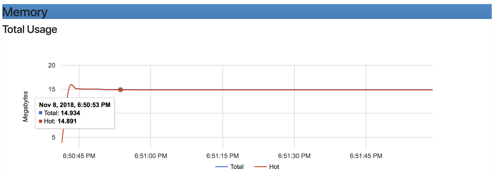
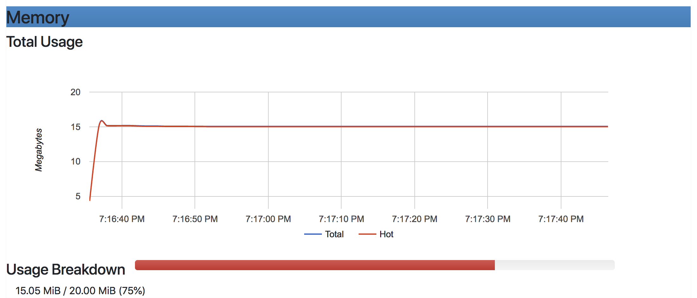
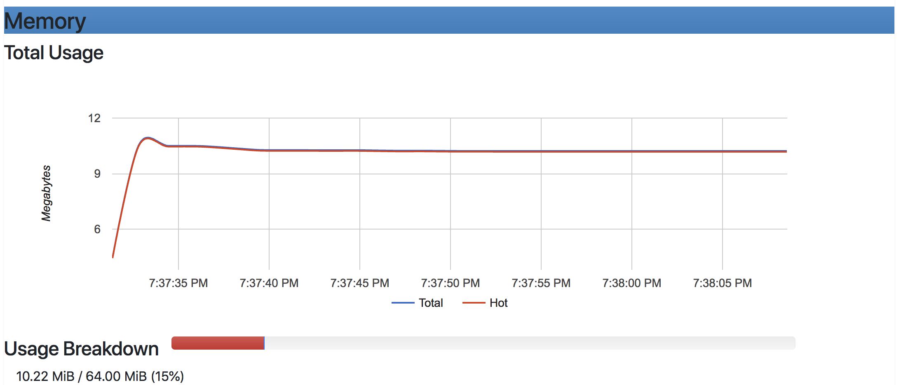
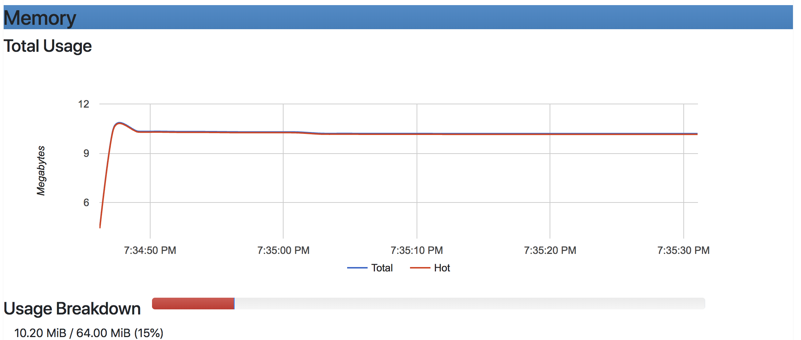

# SHRINKING CONTAINER'S MEMORY

### With Enabled SWAPPING

```
docker run -it -memory 400m -v $(pwd)/target/classes:/src -w /src openjdk:11-jre \
java -XX:+UnlockDiagnosticVMOptions -XX:NativeMemoryTracking=summary -XX:+PrintNMTStatistics \
--add-exports=java.management/sun.management=docker.limits \
--module-path . --module docker.limits/pbouda.sandbox.docker.MemoryFootprint
```

- the rule Heap is 1/4 of provided memory is broken when we go under ~512MB
    - docker run -it -m 512m -> MaxHeap 123MB
    - 400m -> 121MB
    - 256m -> 121MB
    - 244m -> 117MB
    - 200m -> 96MB
    - 100m -> 48MB
    - 64m -> 30MB
    - 32m -> 15MB
    - 16m -> 7MB (InitHeap is 8MB)
    - 8m -> 7MB
    
```
HEAP MEMORY
------------------------
INIT: 4 MB
USED: 1 MB
COMMITTED: 3 MB
MAX: 7 MB

NON-HEAP MEMORY
------------------------
INIT: 7 MB
USED: 2 MB
COMMITTED: 12 MB
MAX: -1 MB
```

### With Disabled SWAPPING

- 400m Docker Container

```
docker run -it --memory 400m --memory-swap 400m -v $(pwd)/target/classes:/src -w /src openjdk:11-jre \
java -XX:+UnlockDiagnosticVMOptions -XX:NativeMemoryTracking=summary -XX:+PrintNMTStatistics \
--add-exports=java.management/sun.management=docker.limits \
--module-path . --module docker.limits/pbouda.sandbox.docker.MemoryFootprint
```



```
Native Memory Tracking:

Total: reserved=1465812KB, committed=41004KB
-                 Java Heap (reserved=129024KB, committed=8192KB)
                            (mmap: reserved=129024KB, committed=8192KB)
```

-  20m Docker Container

```
docker run -it --memory 20m --memory-swap 20m
```



```
Total: reserved=1346641KB, committed=41005KB
-                 Java Heap (reserved=10240KB, committed=8192KB)
                            (mmap: reserved=10240KB, committed=8192KB)
```

-  14m Docker Container

```
docker run -it --memory 14m --memory-swap 14m 
```

`DEAD :)`

### Disabled JIT

```
docker run -it --memory 64m --memory-swap 64m --name with-jit -v $(pwd)/target/classes:/src -w /src openjdk:11-jre java \
--add-exports=java.management/sun.management=docker.limits \
--module-path . --module docker.limits/pbouda.sandbox.docker.MemoryFootprint

docker run -it --memory 64m --memory-swap 64m --name without-jit -v $(pwd)/target/classes:/src -w /src openjdk:11-jre java -Djava.compiler=NONE  \
--add-exports=java.management/sun.management=docker.limits \
--module-path . --module docker.limits/pbouda.sandbox.docker.MemoryFootprint
```




### Disabled JIT + Epsilon GC 

```
docker run -it --memory 64m --memory-swap 64m -v $(pwd)/target/classes:/src -w /src openjdk:11-jre \
java -XX:+UnlockExperimentalVMOptions -XX:+UseEpsilonGC -Djava.compiler=NONE \
--add-exports=java.management/sun.management=docker.limits \
--module-path . --module docker.limits/pbouda.sandbox.docker.MemoryFootprint
```



- Enabled Epsilon without JIT

```
HEAP MEMORY
------------------------
INIT: 6 MB
USED: 1 MB
COMMITTED: 6 MB
MAX: 32 MB

NON-HEAP MEMORY
------------------------
INIT: 2 MB
USED: 1 MB
COMMITTED: 7 MB
MAX: -1 MB
```

- G1GC without JIT

```
HEAP MEMORY
------------------------
INIT: 8 MB
USED: 1 MB
COMMITTED: 7 MB
MAX: 30 MB

NON-HEAP MEMORY
------------------------
INIT: 2 MB
USED: 1 MB
COMMITTED: 7 MB
MAX: -1 MB
```

- G1GC with JIT

```
HEAP MEMORY
------------------------
INIT: 8 MB
USED: 1 MB
COMMITTED: 7 MB
MAX: 30 MB

NON-HEAP MEMORY
------------------------
INIT: 7 MB
USED: 2 MB
COMMITTED: 12 MB
MAX: -1 MB
```